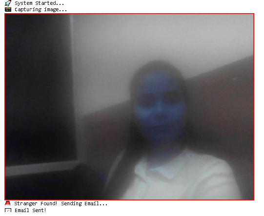

# 📹 CCTV Detection System using Machine Learning

## 🚀 Project Overview

This project presents a **CCTV-based object/person detection system** built using Machine Learning and Computer Vision techniques. The system processes video input (live or recorded), analyzes each frame, and detects objects or individuals in real-time.

The goal is to simulate a **smart surveillance system** that can assist in automated monitoring and security applications.

---

## 🎯 Problem Statement

Traditional CCTV systems only record footage but do not provide intelligent insights. Manual monitoring is time-consuming and inefficient.

👉 This project solves that by:

* Automatically detecting objects/persons
* Reducing human effort in surveillance
* Enabling smarter security systems

---

## 🧠 Approach & Methodology

The system follows a step-by-step pipeline:

1. **Video Input**

   * CCTV footage or video file is captured

2. **Frame Extraction**

   * Video is divided into frames using OpenCV

3. **Preprocessing**

   * Resizing, normalization, and noise reduction

4. **Model Processing**

   * Frames are passed through a trained ML/DL model

5. **Detection**

   * Objects/persons are identified

6. **Visualization**

   * Bounding boxes are drawn on detected objects

---

## 🛠️ Technologies Used

* **Python**
* **OpenCV** (Computer Vision)
* **TensorFlow / Deep Learning**
* **NumPy**
* **Matplotlib**

---

## 🤖 Model Used
- DeepFace (Face Recognition Framework)
- Pre-trained CNN model (VGG-Face)
- Face verification using deep learning embeddings
  
--- 

## ✨ Key Features

* 🎥 Real-time video processing
* 🧍 Object / person detection
* 📦 Bounding box visualization
* ⚡ Efficient frame-by-frame analysis
* 🔍 Scalable for real-world applications

---

## 📂 Project Structure

```
CCTV-Detection-ML/
│
├── CCTV_Detection.ipynb      # Main implementation
├── requirements.txt         # Dependencies
├── README.md                # Project documentation
├── Camera_detection.png     # Output screenshot
```

---

## ▶️ How to Run

1. Clone the repository:

```
git clone https://github.com/shilpatumma/CCTV-Detection-ML.git
```

2. Install dependencies:

```
pip install -r requirements.txt
```

3. Open the notebook:

```
CCTV_Detection.ipynb
```

4. Run all cells step by step

---

## 📸 Output



---

## 📊 Results

* Successfully detects objects/persons from video frames
* Provides real-time visualization using bounding boxes
* Demonstrates practical use of ML in surveillance systems

---

## 🔍 Use Cases

* 🛡️ Security and surveillance systems
* 🏙️ Smart city monitoring
* 🚨 Intrusion detection
* 🏢 Office and public area monitoring

---

## 🚀 Future Improvements

* 🔔 Real-time alert system (email/SMS)
* 🌐 Deploy as web app using Django/Flask
* 📈 Improve model accuracy with advanced architectures (YOLO, CNN)
* ☁️ Cloud deployment for scalability

---

## 🙌 Conclusion

This project demonstrates how Machine Learning and Computer Vision can be combined to build an intelligent CCTV surveillance system. It highlights real-world applications of AI in enhancing security and automation.

---

## 👩‍💻 Author

**Shilpa Tumma**
